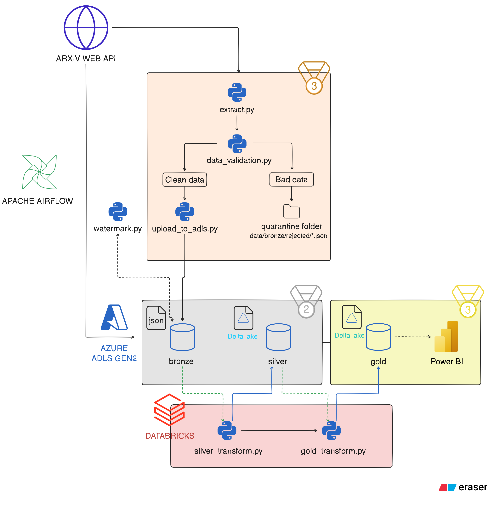

# ArXiv Data Pipeline



## About

Proyek ini adalah pipeline data _end-to-end_ yang mengekstraksi data penelitian dari [arXiv](https://arxiv.org/), memvalidasi kualitas data (Data Quality checks), dan memuatnya ke **Azure Data Lake Storage (ADLS) Gen2**. Seluruh alur kerja (workflow) diorkestrasi menggunakan **Apache Airflow**, dan infrastruktur di-provisioning secara otomatis menggunakan **Terraform** (Infrastructure as Code).

## Medallion Architecture

Proyek ini mengadopsi pola desain data **Medallion Architecture** untuk mengatur kualitas data secara bertahap saat mengalir di dalam Data Lake:

- **🥉 Bronze Layer (Data Mentah / Raw)**: Data hasil ekstraksi API arXiv disimpan dalam bentuk aslinya (JSON) tanpa perubahan.
- **🥈 Silver Layer (Data Bersih / Cleansed)**: Menggunakan **Databricks**, data mentah dari Bronze layer diproses, di-_parse_, dan dibersihkan dengan **PySpark** dan **sql**. Pada tahap ini, duplikat dihapus, kolom-kolom distandardisasi, dan disimpan menggunakan format **Delta Lake**. Data di layer ini siap digunakan untuk _ad-hoc query_ atau _data exploration_.
- **🥇 Gold Layer (Data Teragregasi / Curated)**: Data dari Silver layer diagregasi dan disusun ke dalam model analitik (seperti _Star Schema_ atau _Summary Tables_) menggunakan **Delta Lake**. Data ini kemudian di visualisasikan dengan _Business Intelligence_ (BI) tool, seperti PowerBI, dan _dashboarding_.

## Struktur File

```text
arxiv_pipeline/
├── .github/
│   └── workflows/
│       └── ci.yml                # CI/CD pipelines (lint, test, DAG checks)
├── airflow/
│   └── dags/                     # Airflow DAGs folder
│       ├── pipeline.py           # Main DAG: watermark → extract → DQ → save → upload → trigger
│       └── scripts/
│           ├── extract_arxiv.py  # Ekstraksi API arXiv (date-range query, pagination)
│           ├── data_quality.py   # Pengecekan null, duplikat, invalid data
│           ├── watermark.py      # Pengelolaan incremental high-water mark
│           └── upload_to_adls.py # Logika upload ke Azure Data Lake Storage
├── databricks/
│   └── silver_transform.py       # Transformasi data Bronze JSON → Partitioned Delta MERGE
├── infra/                        # Konfigurasi Terraform
│   ├── providers.tf              # Config provider Azure (azurerm)
│   ├── variables.tf              # Deklarasi variabel
│   ├── main.tf                   # Resource group, ADLS Gen2, Key Vault
│   ├── outputs.tf                # Output nama storage account, dll
│   └── terraform.tfvars.example  # Template variabel infrastruktur
├── tests/                        # Pytest suite untuk unit testing CI
│   ├── conftest.py
│   ├── test_extract_arxiv.py
│   ├── test_data_quality.py
│   └── test_watermark.py
├── docker-compose.yaml           # Konfigurasi untuk menjalankan layanan via Docker
├── requirements.txt              # Production dependencies
└── requirements-dev.txt          # Development dependencies (pytest, ruff)
```
